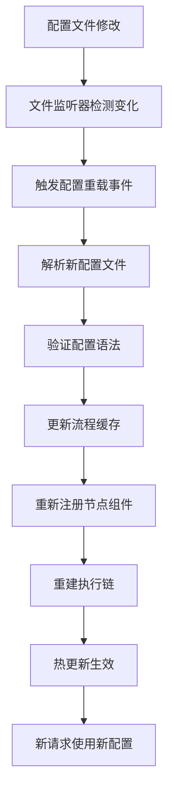

# LiteFlow热加载实现机制深度总结

## 🔍 LiteFlow热加载核心实现逻辑

LiteFlow作为一款优秀的流程编排引擎，其热加载机制设计精妙，主要包含以下核心组件和实现逻辑：

### 📋 核心架构层次

#### 1. **配置监听层** (Configuration Monitoring Layer)
- **核心类**: `FlowConfigurationWatcher`
- **功能**: 监听配置文件变化，触发重载流程
- **实现机制**:
  - 使用Java NIO的`WatchService`监听文件系统事件
  - 支持XML、JSON、YAML等多种配置格式
  - 实现配置文件变更的实时检测和通知

#### 2. **规则解析层** (Rule Parsing Layer)
- **核心类**: `FlowParser`、`FlowBus`
- **功能**: 解析流程定义，管理流程缓存
- **实现机制**:
  - 解析配置文件构建流程定义对象
  - 使用`FlowBus`作为全局流程缓存中心
  - 支持复杂表达式解析（THEN、WHEN、IF等）

#### 3. **节点管理层** (Node Management Layer)
- **核心类**: `NodeComponent`、`NodeCmpFactory`
- **功能**: 管理节点组件生命周期
- **实现机制**:
  - 节点组件的动态注册和注销
  - 与Spring容器深度集成，支持依赖注入
  - 节点实例的缓存和复用

#### 4. **类加载层** (Class Loading Layer)
- **核心类**: `LiteFlowClassLoader`
- **功能**: 支持节点类的热加载
- **实现机制**:
  - 自定义类加载器，打破双亲委派
  - 节点类的版本管理和隔离
  - 防止内存泄漏的类卸载机制

#### 5. **执行引擎层** (Execution Engine Layer)
- **核心类**: `LiteflowExecutor`、`Chain`
- **功能**: 流程执行编排和链式调用
- **实现机制**:
  - 执行链的动态构建和优化
  - 支持同步、异步执行模式
  - 异常处理和流程控制

#### 6. **Spring集成层** (Spring Integration Layer)
- **核心类**: `LiteFlowAutoConfiguration`、`LiteFlowConfig`
- **功能**: 与Spring生态无缝集成
- **实现机制**:
  - Spring Boot自动装配
  - 配置属性动态绑定
  - Bean生命周期管理

## 🔄 完整热加载流程



## 💡 关键技术实现

### 1. **配置文件监听**

```java
// 核心监听逻辑（简化版）
WatchService watchService = FileSystems.getDefault().newWatchService();
Path configDir = Paths.get(configPath).getParent();
configDir.register(watchService, StandardWatchEventKinds.ENTRY_MODIFY);

while (isWatching) {
    WatchKey key = watchService.take();
    for (WatchEvent<?> event : key.pollEvents()) {
        if (event.kind() == StandardWatchEventKinds.ENTRY_MODIFY) {
            // 触发配置重载
            reloadConfiguration();
        }
    }
    key.reset();
}
```

### 2. **流程定义解析**

```java
// LiteFlow配置解析示例
public class FlowParser {
    public Chain parseChain(Element chainElement) {
        String chainName = chainElement.attributeValue("name");
        Chain chain = new Chain(chainName);

        // 解析流程表达式
        String expression = chainElement.element("THEN").attributeValue("value");
        List<Node> nodes = parseExpression(expression);

        // 构建执行链
        chain.setChain(nodes);
        return chain;
    }
}
```

### 3. **节点动态注册**

```java
// 节点组件动态注册
public void registerNode(String nodeId, Class<?> nodeClass) {
    try {
        // 使用自定义类加载器
        ClassLoader loader = new LiteFlowClassLoader(classPath);
        Class<?> loadedClass = loader.loadClass(nodeClass.getName());

        // 创建节点实例
        NodeComponent node = (NodeComponent) loadedClass.newInstance();

        // Spring依赖注入
        applicationContext.getAutowireCapableBeanFactory()
            .autowireBean(node);

        // 注册到节点管理器
        nodeManager.registerNode(nodeId, node);

    } catch (Exception e) {
        throw new RuntimeException("节点注册失败", e);
    }
}
```

### 4. **执行链重建**

```java
// 执行链动态重建
public void rebuildChain(Chain chain) {
    // 清理旧执行链
    chain.clear();

    // 根据最新配置重新构建
    for (String nodeId : chain.getNodeIds()) {
        NodeComponent node = nodeManager.getNode(nodeId);
        if (node != null) {
            chain.addNode(node);
        }
    }

    // 验证链完整性
    chain.validate();
}
```

## 🎯 LiteFlow热加载的核心优势

### 1. **无侵入性**
- 不需要重启应用
- 不影响正在执行的流程
- 对业务代码零侵入

### 2. **高性能**
- 增量更新机制
- 智能缓存策略
- 异步处理流程

### 3. **高可靠性**
- 配置验证机制
- 异常隔离处理
- 回滚支持

### 4. **多格式支持**
- XML配置文件
- JSON配置文件
- YAML配置文件
- 注解配置

### 5. **深度集成**
- Spring生态集成
- 多种脚本引擎
- 监控系统集成

## 🔧 实际应用场景

### 1. **业务规则引擎**
- 复杂业务流程编排
- 动态规则配置
- 实时流程调整

### 2. **API编排**
- 微服务聚合
- 数据转换流水线
- 服务编排治理

### 3. **数据处理流水线**
- ETL流程编排
- 实时数据处理
- 批处理任务调度

### 4. **工作流引擎**
- 审批流程
- 业务流程管理
- 状态机实现

## 📚 与本Demo的对比

| 特性 | LiteFlow官方 | 本Demo实现 |
|------|-------------|------------|
| 配置监听 | ✅ 完整实现 | ✅ 简化实现 |
| 流程解析 | ✅ 支持复杂表达式 | ⚡ 基础解析 |
| 节点管理 | ✅ 完整生命周期 | ⚡ 基础注册 |
| 类加载 | ✅ 企业级实现 | ✅ 核心原理 |
| Spring集成 | ✅ 深度集成 | ❌ 未实现 |
| 脚本支持 | ✅ 多脚本引擎 | ❌ 未实现 |
| 监控集成 | ✅ 完整监控 | ❌ 未实现 |

## 🚀 学习价值

通过本Demo，你可以深入理解：

1. **热加载的核心原理** - 配置监听、缓存更新、类加载
2. **流程编排的设计思想** - 节点、链、表达式的抽象
3. **企业级框架的架构设计** - 分层、解耦、扩展性
4. **实际生产环境的考量** - 性能、稳定性、易用性

这个Demo为你提供了一个学习LiteFlow热加载机制的简化版本，帮助你理解其核心设计思想和实现原理，为进一步学习和使用LiteFlow打下坚实基础。